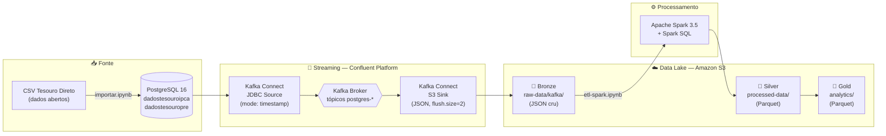
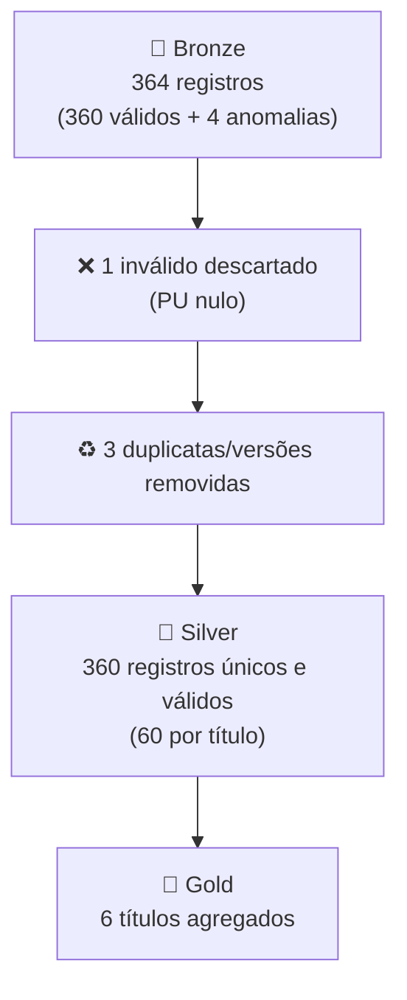

<div align="center">

# 🏛️ Pipeline de Dados — Tesouro Direto
### Arquitetura *Medallion* (Bronze · Silver · Gold) com Kafka Connect e Apache Spark

**Desafio Final — Pós-graduação em Engenharia e Arquitetura de Dados com Inteligência Artificial**


</div>

---

## 📑 Índice

- [Visão geral](#-visão-geral)
- [Objetivos](#-objetivos)
- [Arquitetura da solução](#-arquitetura-da-solução)
- [Stack de tecnologias](#-stack-de-tecnologias)
- [Estrutura do repositório](#-estrutura-do-repositório)
- [Modelo de dados](#-modelo-de-dados)
- [O pipeline Medallion](#-o-pipeline-medallion-bronze--silver--gold)
- [Resultados e prova de execução](#-resultados-e-prova-de-execução)
- [Como executar](#-como-executar)
- [Segurança](#-segurança)
- [Entregáveis do desafio](#-entregáveis-do-desafio)
- [Autor](#-autor)

---

## 🎯 Visão geral

Este projeto implementa um **pipeline de engenharia de dados ponta a ponta** para os preços
e taxas dos títulos públicos do **Tesouro Direto** (dados abertos do Tesouro Transparente).

Os dados são ingeridos em um banco relacional, transportados em tempo quase real por um
barramento de eventos até um *data lake* na nuvem e, então, refinados em três camadas de
qualidade crescente (**Bronze → Silver → Gold**) com processamento distribuído, culminando
em tabelas analíticas consultáveis via **Spark SQL**.

```
CSV (dados abertos) → PostgreSQL → Kafka Connect → Kafka → Amazon S3 → Apache Spark → Analytics
```

---

## 🎯 Objetivos

| # | Objetivo | Como é atendido |
|---|----------|-----------------|
| 1 | **Ingerir** dados de fonte relacional | `importar.ipynb` carrega o CSV oficial no PostgreSQL |
| 2 | **Capturar mudanças** e transportar via streaming | Kafka Connect **JDBC Source** (modo *timestamp*) |
| 3 | **Persistir** o dado bruto em um *data lake* | Kafka Connect **S3 Sink** (JSON, camada Bronze) |
| 4 | **Refinar** com processamento distribuído | Apache Spark: limpeza, deduplicação e tipagem (Silver) |
| 5 | **Disponibilizar** visões analíticas | Agregações por título + Spark SQL (Gold) |
| 6 | **Garantir reprodutibilidade e governança** | Docker Compose, ambiente Conda fixo e `.gitignore`/segurança |

---

## 🏗️ Arquitetura da solução



> **Orquestração:** toda a plataforma sobe via `docker-compose` (Zookeeper, Broker, Schema
> Registry, Kafka Connect customizado, ksqlDB e REST Proxy), em uma rede Docker compartilhada.

---

## 🧰 Stack de tecnologias

| Camada | Tecnologia | Versão | Papel no projeto |
|--------|-----------|--------|------------------|
| **Ingestão** | Python · pandas · SQLAlchemy | 3.11 | Carga do CSV oficial no PostgreSQL |
| **Fonte** | PostgreSQL | 16 | Banco relacional de origem (CDC por *timestamp*) |
| **Streaming** | Apache Kafka (Confluent Platform) | 7.5.0 | Barramento de eventos |
| **Conectores** | Kafka Connect — JDBC Source / S3 Sink | 10.7.4 / 10.5.7 | Movimentação Postgres → Kafka → S3 |
| **Data Lake** | Amazon S3 | — | Armazenamento Bronze / Silver / Gold |
| **Processamento** | Apache Spark + Spark SQL | 3.5.1 | ETL distribuído e analytics |
| **Formato analítico** | Apache Parquet (Snappy) | — | Silver e Gold colunar e comprimido |
| **Orquestração** | Docker · Docker Compose | — | Infraestrutura reproduzível |
| **Ambiente** | Conda · Jupyter · OpenJDK | 3.11 / 11 | Reprodutibilidade (evita PEP 668) |
| **Governança** | IAM Bucket Policies · `.gitignore` | — | Controle de acesso e proteção de segredos |

---

## 📂 Estrutura do repositório

```
ProjetoFinal/
├── docker-compose.yml                    # Plataforma Confluent (Kafka, Connect, ksqlDB, REST Proxy)
├── environment.yml / requirements.txt    # Ambiente reproduzível (Python 3.11)
│
├── custom-kafka-connector-image/
│   └── Dockerfile                        # Imagem connect-custom:1.0.0 (JDBC + S3 + driver PG)
│
├── postgres/
│   ├── docker-compose.yml                # Banco fonte (PostgreSQL 16)
│   └── init/01_schema.sql                # Tabelas dadostesouroipca / dadostesouropre
│
├── connectors/
│   ├── source/  *.config.example         # Postgres → Kafka (JDBC Source)
│   └── sink/    *.config.example         # Kafka → S3 (S3 Sink)
│
├── notebooks/
│   ├── importar.ipynb                    # Ingestão CSV → PostgreSQL
│   └── etl-spark.ipynb                   # Spark: Bronze → Silver → Gold
│
├── spark/
│   └── docker-compose.yml                # Spark + Jupyter (jars hadoop-aws / aws-sdk)
│
├── iam/
│   └── bucket-policy-0{1,2}.json         # Políticas de acesso aos buckets S3
│
├── scripts/
│   ├── gerar_dados_tesouro.py            # Gera CSV oficial (fallback offline)
│   ├── criar_topicos.sh                  # Cria os tópicos Kafka
│   ├── registrar_conectores.sh           # Registra source + sink
│   ├── gerar_bronze_json.py              # Bronze JSON no formato do S3 sink
│   ├── rodar_etl_local.py                # ETL Spark sem AWS (prova local)
│   └── pre-commit-security-check.sh      # Verificação de segredos antes do commit
│
├── evidencias/                           # ✅ PROVA: execução real do Spark
│   ├── log_etl_spark.txt                 # Saída Bronze/Silver/Gold + Spark SQL
│   ├── bronze/                           # JSON cru (idêntico ao S3 sink)
│   └── lakehouse/                        # Parquet Silver + Gold
│
├── GUIA_DE_TESTE.md                      # Passo a passo de execução na AWS
└── SECURITY.md                           # Guia de segurança e checklist de commit
```

> 🔒 Os arquivos `.config` e `.env` **reais** não são versionados — apenas seus templates
> `.example`. Veja [Segurança](#-segurança).

---

## 🗃️ Modelo de dados

As duas tabelas-fonte (IPCA e Prefixado) compartilham o mesmo esquema:

| Coluna | Tipo | Descrição |
|--------|------|-----------|
| `Tipo` | `TEXT` | Nome completo do título (chave de negócio) |
| `Data_Vencimento` | `TIMESTAMP` | Vencimento do título |
| `Data_Base` | `TIMESTAMP` | Data de referência da cotação |
| `CompraManha` / `VendaManha` | `DOUBLE` | Taxa de compra / venda (manhã) |
| `PUCompraManha` / `PUVendaManha` | `DOUBLE` | Preço unitário de compra / venda |
| `PUBaseManha` | `DOUBLE` | Preço unitário base |
| `dt_update` | `TIMESTAMP` | Carimbo de atualização (usado pelo CDC do Kafka Connect) |

Índices em `dt_update` aceleram a captura incremental do **JDBC Source** (modo `timestamp`).

---

## 🥉🥈🥇 O pipeline Medallion (Bronze · Silver · Gold)

| Camada | Local (S3) | Formato | Transformações |
|--------|-----------|---------|----------------|
| **🥉 Bronze** | `raw-data/kafka/...` | JSON | Dado cru, exatamente como entregue pelo S3 Sink |
| **🥈 Silver** | `processed-data/.../silver/` | Parquet | Descarte de inválidos · deduplicação por chave de negócio · conversão de datas (epoch ms → `date`) · normalização |
| **🥇 Gold** | `analytics/.../gold/` | Parquet | Agregações por título: média/mín/máx de PU, média de taxa, contagem |

**Regras de qualidade aplicadas na Silver:**

- **Deduplicação real por chave de negócio** (`Tipo` + `Data_Vencimento` + `Data_Base`) via
  `row_number()` em janela, mantendo o `dt_update` mais recente — trata duplicatas exatas **e**
  versões atualizadas do mesmo registro.
- **Registros inválidos** (sem preço de compra/venda) são **descartados**, evitando distorcer
  as médias da Gold (em vez de preencher com zero).
- **Datas** convertidas de epoch em milissegundos para o tipo `date`.

---

## 📊 Resultados e prova de execução

> Execução **real** do Apache Spark (registrada em `evidencias/log_etl_spark.txt`). A única
> diferença para o ambiente do enunciado é `s3a://` → caminho local, mantendo o código idêntico.

### Funil de qualidade dos dados (IPCA)



### Quantitativo por camada

| Camada | IPCA | PRE |
|--------|:----:|:---:|
| Bronze (registros) | 364 | 300 |
| Silver — inválidos descartados | 1 | 0 |
| Silver — duplicatas/versões removidas | 3 | 0 |
| **Silver final (Parquet)** | **360** | **300** |
| **Gold (títulos agregados)** | **6** | **5** |

### Camada Gold — IPCA (médias por título)

| Título | PU Compra (médio) | PU Venda (médio) | Taxa Compra (média) | PU mín | PU máx | Registros |
|--------|:----:|:----:|:----:|:----:|:----:|:----:|
| Tesouro IPCA+ 2026 | 996,26 | 994,82 | 6,10 | 987,42 | 1007,03 | 60 |
| Tesouro IPCA+ 2029 | 996,16 | 994,58 | 6,46 | 985,74 | 1007,04 | 60 |
| Tesouro IPCA+ 2035 | 997,47 | 995,83 | 6,60 | 986,77 | 1006,03 | 60 |
| Tesouro IPCA+ c/ Juros Sem. 2035 | 996,20 | 994,82 | 6,55 | 986,45 | 1005,58 | 60 |
| Tesouro IPCA+ c/ Juros Sem. 2045 | 996,32 | 994,80 | 6,62 | 986,66 | 1005,66 | 60 |
| Tesouro IPCA+ c/ Juros Sem. 2055 | 996,48 | 995,05 | 6,65 | 986,42 | 1005,83 | 60 |

### Camada Gold — Prefixado (médias por título)

| Título | PU Compra (médio) | PU Venda (médio) | Taxa Compra (média) | PU mín | PU máx | Registros |
|--------|:----:|:----:|:----:|:----:|:----:|:----:|
| Tesouro Prefixado 2025 | 4205,72 | 4198,82 | 10,40 | 4165,42 | 4250,48 | 60 |
| Tesouro Prefixado 2027 | 4208,40 | 4201,88 | 11,20 | 4164,28 | 4247,13 | 60 |
| Tesouro Prefixado 2029 | 4203,26 | 4196,19 | 11,85 | 4163,11 | 4248,15 | 60 |
| Tesouro Prefixado c/ Juros Sem. 2031 | 4204,83 | 4198,34 | 12,05 | 4163,01 | 4249,36 | 60 |
| Tesouro Prefixado c/ Juros Sem. 2033 | 4209,43 | 4203,13 | 12,25 | 4162,02 | 4250,62 | 60 |

> As 4 anomalias injetadas no Bronze IPCA (1 duplicata exata, 1 par versão antiga/atualizada
> da mesma chave e 1 registro com PU nulo) são corretamente tratadas: a Silver fica com
> exatamente **360 registros únicos e válidos** (60 por título).

---

## 🚀 Como executar

### Pré-requisitos
- **Docker** e **Docker Compose**
- Conta **AWS** com 2 buckets S3 (região `us-east-1`)
- **Anaconda/Miniconda** (ambiente Python 3.11)

### 1. Ambiente Python (faça isto primeiro)

```bash
conda env create -f environment.yml
conda activate tesouro
python -m ipykernel install --user --name tesouro --display-name "Python (tesouro)"
```

> Usar **Conda com Python 3.11** evita o erro `externally-managed-environment` (PEP 668)
> e a ausência de *wheels* para versões muito novas do Python.

### 2. Configurar credenciais (nunca versionadas)

```bash
cp .env_kafka_connect.example .env_kafka_connect   # preencha com suas chaves AWS
cp spark/.env.example spark/.env                   # idem para o Spark
# preencha connectors/**/*.config a partir dos respectivos .example
```

### 3. Subir a infraestrutura

```bash
docker network create tesouro-net
cd custom-kafka-connector-image && docker buildx build . -t connect-custom:1.0.0 && cd ..
cd postgres && docker-compose up -d && cd ..     # banco fonte
docker-compose up -d                             # plataforma Confluent
```

### 4. Ingestão, conectores e ETL

```bash
# Ingestão: rode notebooks/importar.ipynb no kernel "Python (tesouro)"
bash scripts/criar_topicos.sh
bash scripts/registrar_conectores.sh             # source + sink
cd spark && docker-compose up -d                 # Spark + Jupyter em http://localhost:8888
# rode notebooks/etl-spark.ipynb → gera Silver e Gold no S3
```

📖 **Passo a passo detalhado (com prints e validações):** veja [`GUIA_DE_TESTE.md`](./GUIA_DE_TESTE.md).

---

## 🔐 Segurança

Este repositório segue boas práticas de proteção de segredos — detalhes em
[`SECURITY.md`](./SECURITY.md).

- ✅ **Nenhuma credencial real versionada.** Todos os `.env` e `.config` reais estão no
  `.gitignore`; apenas os templates `.example` (com placeholders) são commitados.
- ✅ **Identificadores mascarados.** Access Key ID, Account ID e usuário IAM foram
  substituídos por placeholders (`<ACCOUNT_ID>`, `<USUARIO_IAM>`, `<SEU_ACCESS_KEY_ID>`) na
  documentação e nas *bucket policies*.
- ✅ **Verificação pré-commit** disponível em `scripts/pre-commit-security-check.sh`.
- 🔁 **Rotacione as chaves AWS** após cada execução e **revogue** as access keys usadas em testes.

> ⚠️ Antes de tornar o repositório público, confirme com
> `git status` e `git check-ignore .env_kafka_connect` que nenhum segredo será enviado.

---

## ✅ Entregáveis do desafio

| # | Entregável | Onde encontrar |
|---|-----------|----------------|
| 1 | Tabelas no PostgreSQL | `postgres/init/01_schema.sql` + `notebooks/importar.ipynb` |
| 2 | Código Spark / Spark SQL | `notebooks/etl-spark.ipynb` + `evidencias/log_etl_spark.txt` |
| 3 | Dados no S3 organizados e particionados | Bronze (`raw-data/kafka/`), Silver e Gold — espelhados em `evidencias/` |
| 4 | Pipeline de streaming | `docker-compose.yml` + `connectors/` + `scripts/` |
| 5 | Prova de execução | `evidencias/` (JSON Bronze + Parquet Silver/Gold + log) |

---

## 👤 Autor

**César Augusto Barbosa Xavier**
Pós-graduação em Engenharia e Arquitetura de Dados com Inteligência Artificial — Desafio Final (DESF5)

<div align="center">

*Pipeline de dados ponta a ponta · Arquitetura Medallion · Streaming + Lakehouse*

</div>
